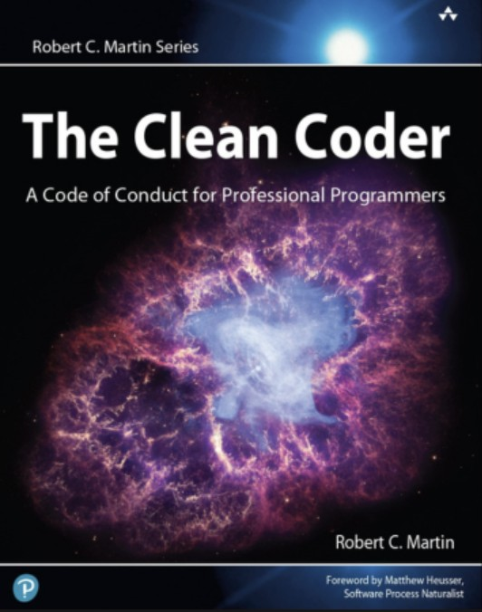

+++
title = "Clean Coder needs more mastery"
date = 2012-12-30T13:26:29Z
draft = false
tags = ["Clean Code", "Motivation"]
categories = ["Books"]
+++

I would like to share my thougths about this book I’ve read recently. The book is titled [The Clean Coder](https://www.amazon.co.uk/dp/0137081073/ref=as_li_ss_til?tag=publicfunctio-21&camp=2902&creative=19466&linkCode=as4&creativeASIN=0137081073&adid=0GABQQFTGF8K17C9PQW2&), and its written by Robert C. Martin.

Robert C. Martin (aka Uncle Bob) is known to host seminars and articles he posts on his site. And of course the books he published. I presume, the [Clean Code](https://www.amazon.co.uk/dp/0132350882/ref=as_li_ss_til?tag=publicfunctio-21&camp=2902&creative=19466&linkCode=as4&creativeASIN=0132350882&adid=14X5844K5VST9JFVYGFP&) and the [Agile Patterns, Principles and Practices](https://www.amazon.co.uk/dp/0131857258/ref=as_li_ss_til?tag=publicfunctio-21&camp=2902&creative=19466&linkCode=as4&creativeASIN=0131857258&adid=1ZE5E8ZZ8NW60EPZXVEX&) are well known.

I’ve encountered many discussion forums and blogs with the subject of having the Clean Code, based on rules and principles in the book. I also participate in one of these groups that focuses on  Clean Coding in our company.  I’ve seen groups which categorize his rules and assign ranks similar to the belt system in martial arts for target achievements. I find that going a bit too far as in only following the rules blindly and completely disregarding other elements of software design. I suggest them to read another book of Uncle Bob named “The Pattern, Principles and Practices”

Nevertheless, this book is not about mastering the clean code itself but rather becoming a clean coder. What is a Clean Coder? Exactly, he shares his vast experiences (from the 70s to this day) en route to become a professional software engineer, or by his words to become a clean coder. There are in total 14 chapters in the book and each one is about a different skill which one should master in the Software business. They are abilities like making estimations, being able to say no, having the proper software testing, teams and collaboration and so forth.

The chapter which I specifically would like to mention is the "Practicing" chapter. He says, we should improve our technical skills, so far so good. Here comes the discussion. According to him, a clean coder shouldn’t expect from his/her employer to give them the time to practice and they should invest 20 hours per week from their personal time.

I for one believe one should always improve themselves and of course we already are using our personal time to do so. I personally invest an average of. 15 hours per week (including some time from my weekends) for practicing, reading books and articles as well as working on a hobby project. But during office hours I would expect my employer to support me as long as my main project doesn’t suffer from it. Sometimes a coder needs trial and error before deciding on the ultimate solution. I don’t think we’ll be able to function at 100% if this element is removed from office hours.

Many companies have their employees attend seminars and/or training courses to allow them to improve themselves. This is without a doubt an investment, increasing the quality and expanding the solution portfolio. This is Win-Win as I’m sure most would agree. The employer  would benefit from allowing the coder to have some time for self improvement purposes, some companies already do have similar practices, for instance Google. A modest 60 minutes a day would already prove a significant ROI. Establishing Clean-Code groups within the company; such activities giving time and space to the coder for mastery is not only beneficial but will increase the motivation of the  employees. There is a great RSA animation, adapted from Dan Pink's speech which illustrates the [hidden truths behind what really motivates us](http://www.youtube.com/watch?v=u6XAPnuFjJc).

My disagreement regarding the mastery for the coder aside, my general impressions of the book is very positive. Uncle Bob’s wise anecdotes about his experience will guide us in becoming a better software engineer, a true clean coder. I believe, there is something for every coder in this book.
