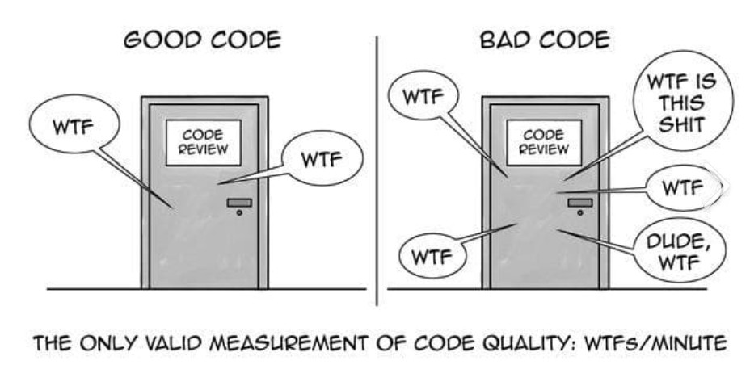

+++
title = "Effective Code Review"
date = 2016-02-17T03:31:06Z
draft = false
tags = ["Clean Code", "Internal Quality", "Quality Assurance"]
categories = ["Software Quality"]
+++

As we all know, code review is maybe the oldest technique to stepping into the software quality assurance realm. Because of the variety of the technologies, project and team sizes, there is no code-review standard. Nevertheless, I would like to share my version I did practice.

Disclaimer: This practices make more sense for the projects which use same code-bases over years (product lines) with high maintainability targeted.  

# Peer Review

  
Everybody is familiar with the peer review. Once a developer feels that his/her job is done and ready for check-in; he/she  

  
-   invites a colleague for a code-review session.  
    
      
    -   It is better to invite a colleague from another subsystem, who doesn’t know the feature or the component is being developed. In this way, he/she needs to explain what is he/she doing and how is he/she implementing and why. A fellow developer from same sub-team would know already all of it and they would skip this part, hence they would skip essential reviews: what, how, why in this way.
      
    
      
    
  

  

  
-   incorporates feedback
  
-   repeats until mutual satisfaction
  
-   commits the changes.
  

  

# But how the feedback should be;

  

  
-   Constructive, instead of criticism.
  
-   Helpful to improve quality and support one another.
  
-   xCops save time for micro-level issues like style and best practices.  
    
      
    -   This point is crucial, mostly style and best practices are subject to heavy discussions. Avoid long running discussions. There should be a coding guidelines empowered by a tool chain. (E.g for .NET : StyleCop/FxCop/R#/Code Analysis or Rosyln based checks)
      
    
      
    
  
-   The Focus should be on Functionality and Principles.
  
-   Be able to explain what is he/she coding and why is he/she coding that way. (Comments !!!)
  
-   Share knowledge across the team.
  

  

# Code review session should focus on;

  

  
-   Functionality  
    
      
    -   Does the implementation cover the feature specification / a user story?
      
    -   Is the implementation covered by a test? (Unit test)
      
    
      
    
  
-   Internal Quality  
    
      
    -   Maintainability (Testability, Modifiability)  
        
          
        -   Complexity, Coupling, Abstraction level.
          
        -   Program to Interface
          
        -   SOLID Principles (Single Responsibility, Open/Close, Liskov Substitution, Dependency Inversion and the Interface Segregation Principles)
          
        -   Clean Coding
          
        -   Code Comments (why the code is in this way)
          
        
          
        
      
    -   Performance!!!
      
    -   Secure code (It can be a separate code-review session)
      
    
      
    
  

  

# What about multi-site teams or developers work from home?

  
Sometimes, due to time or location problems the peer review can’t be practiced. If your development process allows, an asynchronous code review methodology may help. There are tools for helping developers to conduct and manage code reviews. I had good experiences with TFS Code Review but there are [many](https://en.wikipedia.org/wiki/List_of_tools_for_code_review).  

  
-   Mostly useful for distributed development teams. (Different locations)
  
-   Also useful for documentation for the code-review.
  
-   No time-synch needed between participants.
  
-   Invitation can be sent to many participants.
