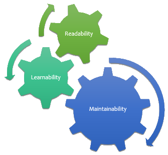

+++
title = "Habitability: A Software Quality Attribute"
date = 2013-06-18T04:18:20Z
draft = false
tags = ["maintainability", "software architect"]
categories = ["Software Quality"]
+++

The term **Habitability** is a “Quality Attribute” that isn’t pronounced often in the coding world. In general the word “Readability” is used because the subtle differences between the two isn’t well known, and this breeds “Maintainability” issues.  
**Readability**, is a “Quality Attribute” that ensures the code can be read by any developer easily. For example: The meanings of the terms Variable, Method and Class and their compliance with readability will improve its understandability and learnability for your team. This becomes more important if your team is large or multi-sited.



But other than readability, there are also other factors that affect **learnability** and therefor **modifiability**. Let’s say you have been developing different versions of a product on .Net over 10 years. Even if you have been, over time adapting your 10 year old NET 1.1 libraries to the new Framework versions; you may not want to risk changing a working system just to use the newly implemented features. This isn’t always a bad decision. I’d like to explain with an example code, take a look at the C# below: Hypothetically you want to locate specific object and use it in some process.

```csharp
using System;
using System.Collections.Generic;

namespace KaanB.Blog.CodeBase.Habitability
{
    class Program
    {
        class SomeData
        {
            public bool SomeBooleanProperty { get; set; }
            public int SomeIntegerProperty { get; set; }
        }

        static void Main(string[] args)
        {
            var someCollection = new List<SomeData>() 
            { 
                new SomeData() 
                    {   
                        SomeBooleanProperty = false, 
                        SomeIntegerProperty = 4 
                    },
                new SomeData() 
                    {
                        SomeBooleanProperty = true, 
                        SomeIntegerProperty = 2
                    },
            };

            foreach (SomeData item in someCollection)
            {
                if (item != null)
                    if (item.SomeBooleanProperty)
                    {
                        PrintData(item); 
                        break;
                    }                
            }
            
            System.Console.ReadKey();
        }

        private static void PrintData(SomeData item)
        {
            System.Console.WriteLine(
                String.Format(
                    "Printing some integer value : {0}", 
                    item.SomeIntegerProperty.ToString()));
        }
    }
}
```

As you can see we can use for-each within “someCollection” to find the object.  
Later another developer is **refactoring** the code, using the **LinQ Extensions** that comes with .Net Framework 3 and brings it “up to date”.

```csharp
static void Main(string[] args)
{
	var someCollection = new List<SomeData>() 
	{ 
		// ...
	};            

	PrintData(
		someCollection
			.Where(item => item.SomeBooleanProperty)
			.First());

	System.Console.ReadKey();
}
```

I’ve experienced a similar situation where in a [code-review](http://www.kaanbardak.com/?p=62) session, a developer was criticizing the readability of the new code because this new style was unfamiliar and difficult to understand for him. The fact that the criticizing developer wasn’t yet retrained in “LinQ Extensions” told me that the new technology wasn’t yet suitable for the project as in the habitat. The conclusion I’ve reached is that until the entire team is re-trained on the new libraries, the use of LinQ will hamper the code-base in terms of habitability.  
Another example **: Inhabitable** class name

```csharp
static void Main(string[] args)
{
	var someCollection = new List<SomeData>();

	SomeDataFactory.SetSomeCachingParameter();
	SomeDataFactory.YouMustCallFirstThisMethod();
	SomeData data = 
		SomeDataFactory.GuesWhatThisIsTheCreateMethod();

	SomeDataFactory.YouShouldntForgetToCallThisLatter();
				
	someCollection.Add(data);

	PrintData(
		someCollection
			.Where(item => item.SomeBooleanProperty)
			.First());

	System.Console.ReadKey();
}
```

In the above example you can observe a static class which implements the **Factory pattern in a wrong way**. Even though the method names are descriptive about its functions, the user code should know what it’s doing. In reality what’s expected from the “factory” is merely the CreateSomeData method. This so-called Factory method, may have good readability properties, but is essentially unsuitable for a habitat that’s used to the good old Factory Pattern.

To maintain habitability, one of the roles of a Software Architect is to prevent habitat incompatibility by preventing these types of problems. These activities should be supervised under Architecture Governance.

The violations can of course be checked using automated tools, for instance Static Code Analysis tools such as FxCop or StyleCop for .Net software development. In addition to these, Visual nDepend and Visual Studio Ultimate Edition which provide software metrics measurements are helpful tools for automatic assistance. But the architect should keep in close touch with the developer team, through various coaching activities such as workshops and code reviews etc. and make sure the habitability doesn’t suffer.

The importance of habitability to maintainability should not be overlooked. Especially if the project is an **API, Platform or Framework project**, one of the most important requirements is habitability, it actually is a functional requirement rather than a non-functional one and the role of the Software Architect is substantial.

UPDATE \[February 2016\] :Kevlin Henney is also mentioning the habitability during his talk in NDC2014 [Kevlin Henney - Patterns for the People (5’ – 7’)](https://vimeo.com/97344527)
